# FastAPI Tutorial Notes


# By Bhargav Rupesh Anand


# For IKF - India Khelo Football / Khelo Football Ecosystem Development Federation


## FAST API Features


1. Automatic documentation (Swagger UI)
2. ReDoc
3. Python 3.6 with type using Pydantic
4. Based on open standards - JSON Schema & Open API
5. Autocomplete in Code Editor (enabled by Pydantic)
6. Security and Authentication
* HTTP Basic 
* OAuth2 (Also with JWT tokens)
* API Keys in headers, query parameters, cookies, etc.

      7.   Dependency Injection, Unlimited plug-ins, Uses PyTest for testing applications

      8.   Starlette Features:


* Websocket support
* GraphQL support
* In-process background tasks
* Startup and shutdown events

      9.   Other Supports


* SQL Databases
* NoSQL Databases
* GraphQL 


## FastAPI vs Django


<p id="gdcalert1" ><span style="color: red; font-weight: bold">>>>>>  gd2md-html alert: inline image link here (to images/image1.png). Store image on your image server and adjust path/filename/extension if necessary. </span><br>(<a href="#">Back to top</a>)(<a href="#gdcalert2">Next alert</a>)<br><span style="color: red; font-weight: bold">>>>>> </span></p>


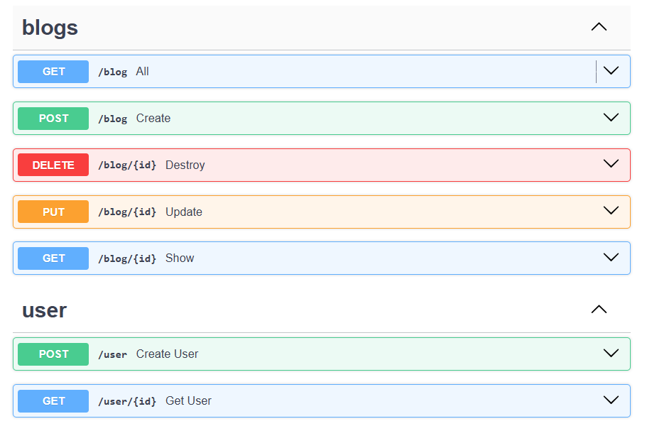


## Installation:


* **pip install fastapi**
* Caution: NOT ON PATH 
* Solution: Control Panel > Environment Variables > Path > Edit > New > (Path mentioned in the warning) > OK > OK > OK
* fastapi --help
* If error:  **pip install "fastapi[standard]"**
* fastapi --help
* Success


## First Program:


```
from fastapi import FastAPI

app = FastAPI()

@app.get('/')

def index():
    return 'heyyy'
```


Four components:


1. Import
2. Instance
3. Decorate
4. Function


## How to Add Multiple Pages (e.g: About page):


```
from fastapi import FastAPI

app = FastAPI()

@app.get('/')
def index():
    return {'data' : {'name' : 'Bhargav'}}

@app.get('/about')
def about():
    return {'data' : {'about page'}}
```


## How to Run:

**> uvicorn main:app --reload**

Note: We say ‘app’ in this command because we declared the instance as app = FastAPI()

If it was myapp (for example), then the command would be: **uvicorn main:myapp --reload**

Note: Similarly, we say ‘main’ because the file is main.py. Change it according to the file name.


## Can 2 Functions have the Same Name?


* In the same page - No
* In different pages - Yes


## Operations (In decorator): 

We have used ‘get’ in the previous codes. We can use ‘post’, ‘put’, ‘delete’, etc.

Format: Decorator > Operation > Path


## Path Parameters


```
from fastapi import FastAPI

app = FastAPI()

@app.get('/')
def index():
    return {'data' : 'blog list'}

@app.get('/blog/{id}')
def show(id):

    # fetch blog with id = id
    return {'data' : id}

@app.get('/blog/{id}/comments')
def comments(id):
    #fetch comments of blog with id = id
    return {'data' : {'1','2'}}
```


**Output 1:**


<p id="gdcalert2" ><span style="color: red; font-weight: bold">>>>>>  gd2md-html alert: inline image link here (to images/image2.png). Store image on your image server and adjust path/filename/extension if necessary. </span><br>(<a href="#">Back to top</a>)(<a href="#gdcalert3">Next alert</a>)<br><span style="color: red; font-weight: bold">>>>>> </span></p>


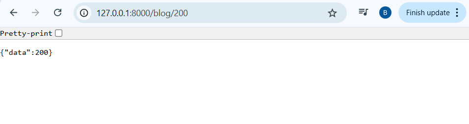


**Output 2:**


<p id="gdcalert3" ><span style="color: red; font-weight: bold">>>>>>  gd2md-html alert: inline image link here (to images/image3.png). Store image on your image server and adjust path/filename/extension if necessary. </span><br>(<a href="#">Back to top</a>)(<a href="#gdcalert4">Next alert</a>)<br><span style="color: red; font-weight: bold">>>>>> </span></p>


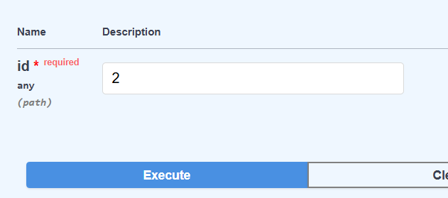


## Defining the Type of Parameter:


```
from fastapi import FastAPI

app = FastAPI()

@app.get('/')
def index():
    return {'data' : 'blog list'}

@app.get('/blog/{id}')
def show(id: int):

    # fetch blog with id = id
    return {'data' : id}

@app.get('/blog/{id}/comments')
def comments(id: int):
    #fetch comments of blog with id = id
    return {'data' : {'1','2'}}
```


<p id="gdcalert4" ><span style="color: red; font-weight: bold">>>>>>  gd2md-html alert: inline image link here (to images/image4.png). Store image on your image server and adjust path/filename/extension if necessary. </span><br>(<a href="#">Back to top</a>)(<a href="#gdcalert5">Next alert</a>)<br><span style="color: red; font-weight: bold">>>>>> </span></p>


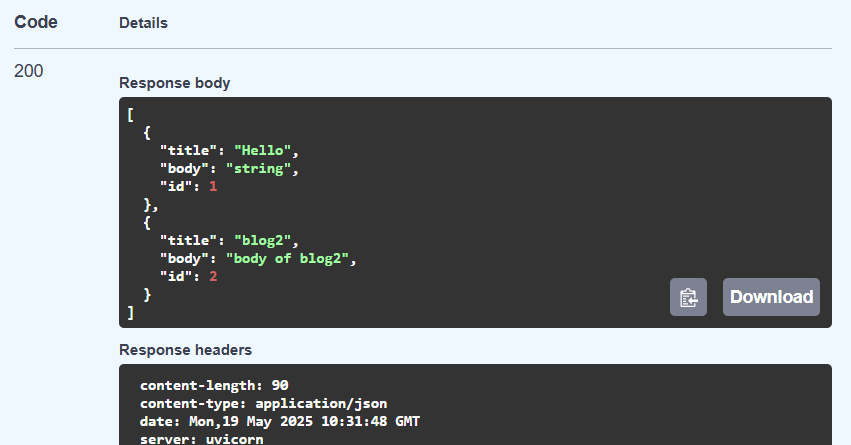


Note no more inverted commas around 200 -> Shows that 200 is no longer a string. It is a string by default.


## Demonstrating Line-by-Line execution in FAST API:


```
from fastapi import FastAPI

app = FastAPI()

@app.get('/')
def index():
    return {'data' : 'blog list'}

@app.get('/blog/{id}')
def show(id : int):

    # fetch blog with id = id
    return {'data' : id}

@app.get('/blog/unpublished')
def unpublished():
    return {'data' : 'all unpublished blogs'}
```


Output:


<p id="gdcalert5" ><span style="color: red; font-weight: bold">>>>>>  gd2md-html alert: inline image link here (to images/image5.png). Store image on your image server and adjust path/filename/extension if necessary. </span><br>(<a href="#">Back to top</a>)(<a href="#gdcalert6">Next alert</a>)<br><span style="color: red; font-weight: bold">>>>>> </span></p>


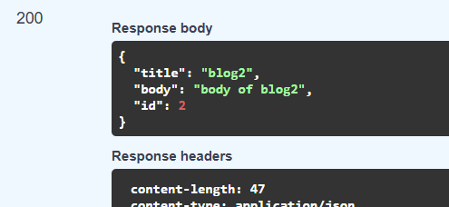


**Problem:** The execution never reaches def unpublished(). It reads def show() where an integer is expected after ‘blog/’ and shows an error because we entered a string.

**Solution: **Move def unpublished() above def show()


## API Docs - Swagger/redocs


* Use URL + /docs
* Or URL + /redoc


## Query Parameters


```
@app.get('/blog')
def index(limit: int, published : bool):

    #only get a certain number of published blogs
    if published:
        return {'data' : f'{limit} published blogs from the db'}
    else:
        return {'data' : f'{limit} blogs from the db'}
```


**Output: **


<p id="gdcalert6" ><span style="color: red; font-weight: bold">>>>>>  gd2md-html alert: inline image link here (to images/image6.png). Store image on your image server and adjust path/filename/extension if necessary. </span><br>(<a href="#">Back to top</a>)(<a href="#gdcalert7">Next alert</a>)<br><span style="color: red; font-weight: bold">>>>>> </span></p>


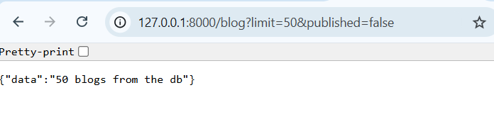


<p id="gdcalert7" ><span style="color: red; font-weight: bold">>>>>>  gd2md-html alert: inline image link here (to images/image7.png). Store image on your image server and adjust path/filename/extension if necessary. </span><br>(<a href="#">Back to top</a>)(<a href="#gdcalert8">Next alert</a>)<br><span style="color: red; font-weight: bold">>>>>> </span></p>


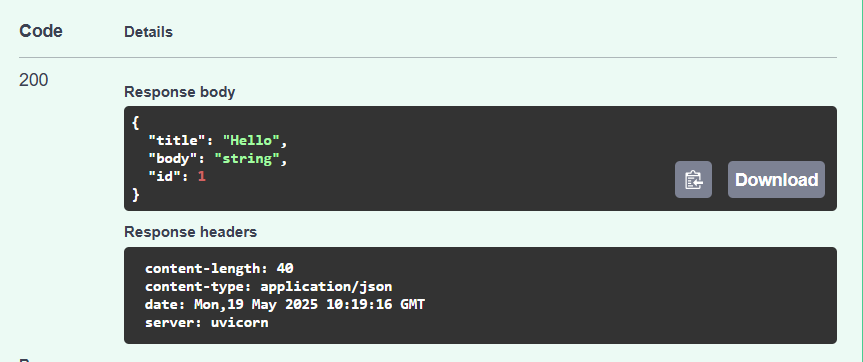


Note: Remember that the type of query parameters must be defined. If we had failed to specify that ‘published’ was a boolean, it would be classified as a string and since it is not null in either of the output cases, it would only show the results in the first output.


## How to Specify Default Parameters


```
@app.get('/blog')
def index(limit: int = 10, published : bool = True):

    #only get a certain number of published blogs
    if published:
        return {'data' : f'{limit} published blogs from the db'}
    else:
        return {'data' : f'{limit} blogs from the db'}
```


## How to Make a Parameter Optional

(They are required by default)


```
from fastapi import FastAPI
from typing import Optional

app = FastAPI()

@app.get('/blog')

def index(limit: int = 10, published : bool = True, sort: Optional[str] = None):

    #only get a certain number of published blogs
    if published:
        return {'data' : f'{limit} published blogs from the db'}
    else:
        return {'data' : f'{limit} blogs from the db'}
```


## How does FASTAPI Differentiate Between Query Params and Path Params


* If a parameter is mentioned in the path as well as function then it is recognized as a path parameter
* If it is mentioned only in the function then it is a query parameter


## Request Body

- Post Method: 


```
from pydantic import BaseModel

class Blog(BaseModel):
    title: str
    body: str
    published: Optional[bool]

@app.post('/blog')
def create_blog(blog: Blog):
    return {'data' : f"Blog is created with {blog.title}"}
```


**Output:**


<p id="gdcalert8" ><span style="color: red; font-weight: bold">>>>>>  gd2md-html alert: inline image link here (to images/image8.png). Store image on your image server and adjust path/filename/extension if necessary. </span><br>(<a href="#">Back to top</a>)(<a href="#gdcalert9">Next alert</a>)<br><span style="color: red; font-weight: bold">>>>>> </span></p>


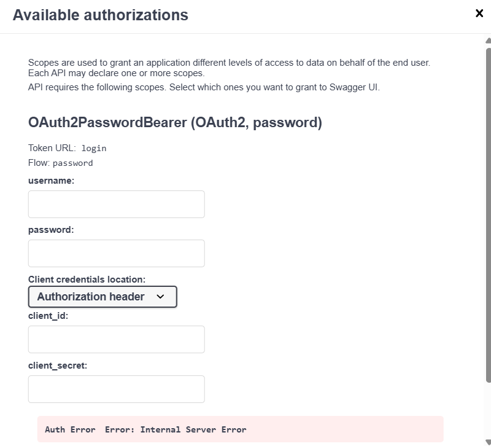


<p id="gdcalert9" ><span style="color: red; font-weight: bold">>>>>>  gd2md-html alert: inline image link here (to images/image9.png). Store image on your image server and adjust path/filename/extension if necessary. </span><br>(<a href="#">Back to top</a>)(<a href="#gdcalert10">Next alert</a>)<br><span style="color: red; font-weight: bold">>>>>> </span></p>


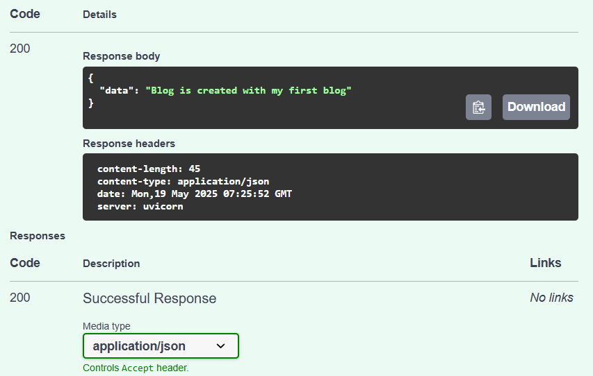


## How to Debug

Apply breakpoint > Ctrl+Shift+P > debug > FastAPI

Use ‘Show Run and Debug’ Option when executing


## To Change Port: 

**At the start of [main.py](main.py):**


```
import uvicorn
```


**At the end of [main.py](main.py): \
**


```
if __name__ == "__main__":
    uvicorn.run(app, host = "127.0.0.1", port = '9000')
```


## Pydantic Schema:

**Usual: **


```
from fastapi import FastAPI

app = FastAPI()

@app.post('/blog')
def create(title, body):
    return {'title' : title, 'body' : body }
```


**Now with Pydantic:**


```
from fastapi import FastAPI
from pydantic import BaseModel

app = FastAPI()

class Blog(BaseModel):
    title: str
    body: str

@app.post('/blog')
def create(request: Blog):
    return request
```


## Connecting FastAPI with SQLite Database

STEP 1: SEPARATING THE SCHEMA

**[schemas.py](schemas.py)**


```
from pydantic import BaseModel

class Blog(BaseModel):
    title: str
    body: str
```


**[main.py](main.py)**


```
from fastapi import FastAPI
from . import schemas

app = FastAPI()

@app.post('/blog')
def create(request: schemas.Blog):
    return request
```


STEP 2: CREATE THE DATABASE CONNECTION

[database.py](database.py)


```
from sqlalchemy import create_engine
from sqlalchemy.ext.declarative import declarative_base
from sqlalchemy.orm import sessionmaker

SQLALCHEMY_DATABASE_URL = 'sqlite:///./blog.db'

engine = create_engine(SQLALCHEMY_DATABASE_URL, connect_args={"check_same_thread" : False})
SessionLocal = sessionmaker(bind = engine, autocommit=False, autoflush=False)

Base = declarative_base()
```


## Model & Table

**Install TablePlus**

STEPS:

Connect > SQLite > Select File > Test > Save

Create [models.py](models.py)


```
from .database import Base
from sqlalchemy import Column, Integer, String

class Blog(Base):
    __tablename__ = 'blogs'
    id = Column(Integer, primary_key = True, index=True)
    title = Column(String)
    body = Column(String)
```


Update [main.py](main.py)


```
from fastapi import FastAPI
from . import schemas
from . import models
from .database import engine

app = FastAPI()
models.Base.metadata.create_all(engine)

@app.post('/blog')
def create(request: schemas.Blog):
    return request
```


Check TablePlus to see if the table is added


## Store Blog to Database

Update [main.py](main.py):


```
from fastapi import FastAPI, Depends
from . import schemas
from . import models
from .database import engine, SessionLocal
from sqlalchemy.orm import Session

app = FastAPI()

models.Base.metadata.create_all(engine)

def get_db():
    db = SessionLocal()
    try:
        yield db


   finally:
        db.close()

@app.post('/blog')
def create(request: schemas.Blog, db : Session = Depends(get_db)):
    new_blog = models.Blog(title=request.title, body=request.body)
    db.add(new_blog)
    db.commit()
    db.refresh(new_blog)
    return new_blog
```


<p id="gdcalert10" ><span style="color: red; font-weight: bold">>>>>>  gd2md-html alert: inline image link here (to images/image10.png). Store image on your image server and adjust path/filename/extension if necessary. </span><br>(<a href="#">Back to top</a>)(<a href="#gdcalert11">Next alert</a>)<br><span style="color: red; font-weight: bold">>>>>> </span></p>


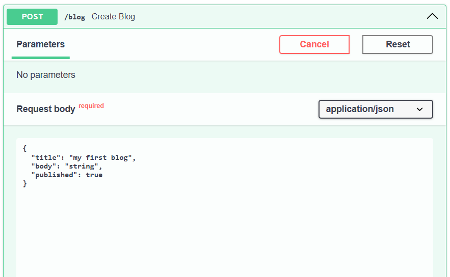


## Get Blogs from Database

Example 1: Fetching all the blogs


```
@app.get('/blog')
def all( db : Session = Depends(get_db)):

    #to get all the blogs
    blogs = db.query(models.Blog).all()

    return blogs
```


**Add another element in the table using ‘post’ in docs. **

**Now we should see 2 elements in ‘get’ in docs.**

OUTPUT:

(Next Page)


<p id="gdcalert11" ><span style="color: red; font-weight: bold">>>>>>  gd2md-html alert: inline image link here (to images/image11.png). Store image on your image server and adjust path/filename/extension if necessary. </span><br>(<a href="#">Back to top</a>)(<a href="#gdcalert12">Next alert</a>)<br><span style="color: red; font-weight: bold">>>>>> </span></p>


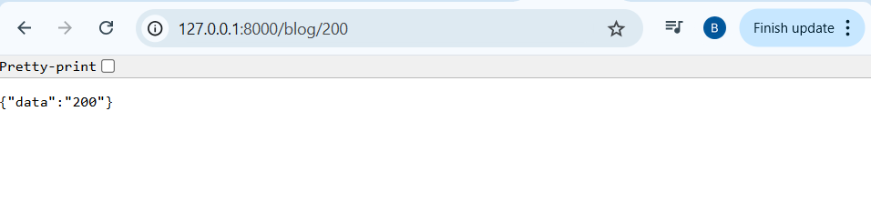


Example 2: Fetching specific blogs by mentioning their id


```
@app.get('/blog/{id}')
def show(id, db: Session = Depends(get_db)):
    blog = db.query(models.Blog).filter(models.Blog.id == id).first()
    return blog
```


-first() ensures that we only get one answer

-filter is equivalent to a ‘where’ clause in SQL.


<p id="gdcalert12" ><span style="color: red; font-weight: bold">>>>>>  gd2md-html alert: inline image link here (to images/image12.png). Store image on your image server and adjust path/filename/extension if necessary. </span><br>(<a href="#">Back to top</a>)(<a href="#gdcalert13">Next alert</a>)<br><span style="color: red; font-weight: bold">>>>>> </span></p>


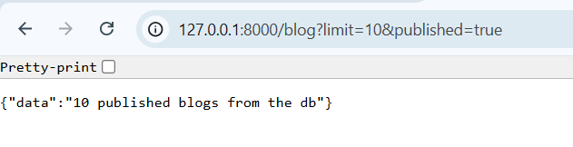
 

<p id="gdcalert13" ><span style="color: red; font-weight: bold">>>>>>  gd2md-html alert: inline image link here (to images/image13.png). Store image on your image server and adjust path/filename/extension if necessary. </span><br>(<a href="#">Back to top</a>)(<a href="#gdcalert14">Next alert</a>)<br><span style="color: red; font-weight: bold">>>>>> </span></p>


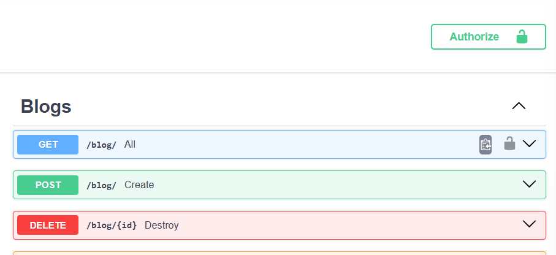


## Exceptions & Status Code


* Try adding a new blog using post.
* You’ll notice that the response code is 200.
* When we add something, the response code should be 201
* How to fix:

    ```
    @app.post('/blog', status_code=201)
    def create(request: schemas.Blog, 
    Continued ...
    ```


* It’s hard to check documentation every single time to get status codes
* Therefore:
* **1) from fastapi import status**
* **2) @app.post('/blog', status_code=status.HTTP_201_CREATED)**
* FastAPI autocompletes everything after ‘status.’

Problem:


* When we try to ‘get’ an Id that does not exist it shows a null response but still gives a 200 response code
* How to fix:


```
@app.get('/blog/{id}', status_code = 200)
def show(id, response: Response, db: Session = Depends(get_db)):
    blog = db.query(models.Blog).filter(models.Blog.id == id).first()

    if not blog:
        response.status_code = status.HTTP_404_NOT_FOUND
    return blog
```


Note: ‘**from fastapi import Response**’ for this to work.


<p id="gdcalert14" ><span style="color: red; font-weight: bold">>>>>>  gd2md-html alert: inline image link here (to images/image14.png). Store image on your image server and adjust path/filename/extension if necessary. </span><br>(<a href="#">Back to top</a>)(<a href="#gdcalert15">Next alert</a>)<br><span style="color: red; font-weight: bold">>>>>> </span></p>


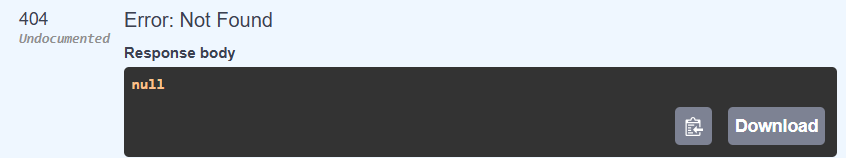


If we wanted to add a message along with the 404 code, or say any message with any code we’d have to do this:


```
    if not blog:
        response.status_code = status.HTTP_404_NOT_FOUND
        return {'detail':"Blog with the id {id} is not available"}
    return blog
```


Instead of writing 2 lines inside ‘if not blog’ : we can use -

**- from fastapi import HTTPException**


```
    if not blog:
        raise HTTPException(status_code = status.HTTP_404_NOT_FOUND, detail = f"Blog with id {id} is not available")
    return blog
```


<p id="gdcalert15" ><span style="color: red; font-weight: bold">>>>>>  gd2md-html alert: inline image link here (to images/image15.png). Store image on your image server and adjust path/filename/extension if necessary. </span><br>(<a href="#">Back to top</a>)(<a href="#gdcalert16">Next alert</a>)<br><span style="color: red; font-weight: bold">>>>>> </span></p>


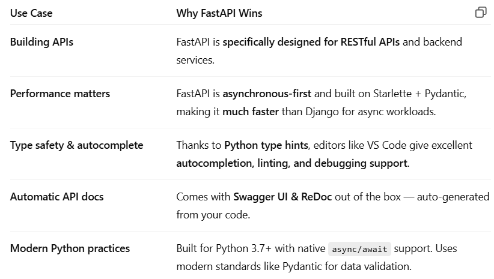


## Deleting a Blog


```
@app.delete('/blog/{id}', status_code = status.HTTP_204_NO_CONTENT)
def destroy(id, db : Session = Depends(get_db)):
    blog = db.query(models.Blog).filter(models.Blog.id == id).delete(synchronize_session = False)
    db.commit()
    return 'done'
```


## Updating a Blog


```
@app.put('/blog/{id}', status_code = status.HTTP_202_ACCEPTED)
def update(id, request: schemas.Blog, db : Session = Depends(get_db)):
    blog = db.query(models.Blog).filter(models.Blog.id == id)
    if not blog.first():
        raise HTTPException(status_code = status.HTTP_404_NOT_FOUND, detail = f'Blog with id {id} not found')
    blog.update(request)
    db.commit()
    return 'updated'
```


Note: We can add this if statement to check if the blog exists or not for the destroy() function as well.


## Response Model

Note that here the pydantic models basically refer to schemas. So a response model is the same as a response schema.

We use this when we don’t want to show all the attributes in response to a get() or show() function. So we can redefine the schema or extend the existing schema as a new class.

**- Updated [schema.py](schema.py)**


```
from pydantic import BaseModel

class Blog(BaseModel):
    title: str
    body: str

class ShowBlog(BaseModel):
    title: str
    class Config():
        orm_mode = True
```


**Updated get() function - Add the response model field**


```
@app.get('/blog/{id}', status_code = 200, response_model = schemas.ShowBlog)
def show(id, response: Response, db: Session = Depends(get_db)):
    blog = db.query(models.Blog).filter(models.Blog.id == id).first()

    if not blog:
        raise HTTPException(status_code = status.HTTP_404_NOT_FOUND, detail = f"Blog with id {id} is not available")
    return blog
```


Now when we execute the get() function, it will only show the title.

**Special Case:**

In the function to get all the blogs, we need to specify a list - and also import the List type.

**- from typing import List**


```
@app.get('/blog', response_model = List[schemas.ShowBlog])
def all( db : Session = Depends(get_db)):

    #to get all the blogs
    blogs = db.query(models.Blog).all()
    return blogs
```


## Creating a User

STEP 1: Make a User Schema in [schema.py](schema.py). (NOTE: THIS IS PYDANTIC MODEL)


```
class User(BaseModel):
    name: str
    email: str
    password: str
```


STEP 2: Make a model for Users in [model.py](model.py) - i.e a new Table in the database. (NOTE: THIS IS SQLALCHEMY MODEL)


```
class User(Base):
    __tablename__ = 'users'
    id = Column(Integer, primary_key = True, index=True)
    name = Column(String)
    email = Column(String)
    password = Column(String)
```


STEP 3: Create the function in [main.py](main.py)


```
@app.post('/user')
def create_user(request: schemas.User, db: Session = Depends(get_db)):
    new_user = models.User(name = request.name, email = request.email, password = request.password)
    db.add(new_user)
    db.commit()
    db.refresh(new_user)
    return request
```


## Hashing the Password

- Install Password Library: **pip install passlib**

- Install BCrypt: **pip install bcrypt**

- In [main.py](main.py): **from passlib.context import CryptContext**


```
pwd_cxt = CryptContext(schemes=["bcrypt"], deprecated="auto")

@app.post('/user')
def create_user(request: schemas.User, db: Session = Depends(get_db)):
    hashedPassword = pwd_cxt.hash(request.password)
    new_user = models.User(name = request.name, email = request.email, password = hashedPassword)
    db.add(new_user)
    db.commit()
    db.refresh(new_user)
    return request
```


- Add a password context: pwd_cxt

- Make a hashed password using the request password (right before creating the new user)

- Replace the request password with the hashed password in the new user creation line

**OUTPUT:**


<p id="gdcalert16" ><span style="color: red; font-weight: bold">>>>>>  gd2md-html alert: inline image link here (to images/image16.png). Store image on your image server and adjust path/filename/extension if necessary. </span><br>(<a href="#">Back to top</a>)(<a href="#gdcalert17">Next alert</a>)<br><span style="color: red; font-weight: bold">>>>>> </span></p>


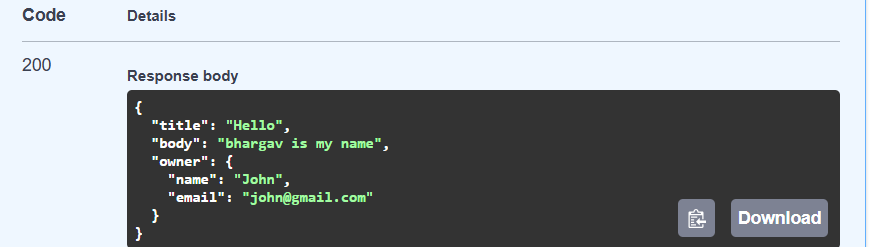


We can also create a separate file for hashing to avoid the clutter.

Import the file and the function

Example: 

**[hashing.py](hashing.py) :**


```
from passlib.context import CryptContext

pwd_cxt = CryptContext(schemes=["bcrypt"], deprecated="auto")

class Hash():
    def bcrypt(password: str):
        return pwd_cxt.hash(password)
```


**Changes to [main.py](main.py) in this case: **


```
from .hashing import Hash

@app.post('/user')
def create_user(request: schemas.User, db: Session = Depends(get_db)):
    new_user = models.User(name = request.name, email = request.email, password = Hash.bcrypt(request.password))
    db.add(new_user)
    db.commit()
    db.refresh(new_user)
    return new_user
```


## Show a User After Creating

- In this case, if we are viewing a user, we do not want to see  their password or other sensitive information. 

- Therefore, we create a request model

**Make a new schema in [schemas.py](schema.py) : **


```
class ShowUser(BaseModel):
    name: str
    email: str
    class Config():
        orm_mode = True
```


**Change in [main.py](main.py) :**


```
@app.post('/user', response_model= schemas.ShowUser)
```


## Get a User in Database


```
@app.get('/user/{id}', response_model = schemas.ShowUser)
def get_user(id:int, db: Session = Depends(get_db)):
    user = db.query(models.User).filter(models.User.id == id).first()
    if not user:
        raise HTTPException(status_code = status.HTTP_404_NOT_FOUND, detail = f"User with id {id} not found")
    return user
```


## Using Doc Tags

Example:


```
@app.get('/user/{id}', response_model = schemas.ShowUser, tags=['user'])
```


## Relationships in FastAPI

 Primitive Version: Make the following changes to [models.py](models.py) 


```
from .database import Base
from sqlalchemy import Column, Integer, String, ForeignKey
from sqlalchemy.orm import relationship

class Blog(Base):
    __tablename__ = 'blogs'
    id = Column(Integer, primary_key = True, index=True)
    title = Column(String)
    body = Column(String)
    user_id = Column(Integer, ForeignKey('users.id'))

    owner = relationship("User", back_populates="blog")

class User(Base):
    __tablename__ = 'users'
    id = Column(Integer, primary_key = True, index=True)
    name = Column(String)
    email = Column(String)
    password = Column(String)

    blog = relationship("Blog", back_populates="owner")
```


Note: You’ll have to delete the old tables without the foreign keys, run the program again to see the new tables.

Then change [main.py](main.py) in the place where the blogs are being created


```
@app.post('/blog', status_code=status.HTTP_201_CREATED, tags=['blogs'])
def create(request: schemas.Blog, db : Session = Depends(get_db)):
    new_blog = models.Blog(title=request.title, body=request.body, user_id = 1)
    db.add(new_blog)
    db.commit()
    db.refresh(new_blog)
    return new_blog
```


For now, we’ve hardcoded the user_id = 1. We’ll work on this later.

We’ll also have to edit the file [schemas.py](schemas.py) to add the ‘owner’ attribute in the ShowBlog schema. We also need to move the ShowBlog schema below the ShowUser schema for it to recognise the value.


```
from pydantic import BaseModel
class ShowUser(BaseModel):
    name: str
    email: str
    class Config():
        orm_mode = True

class ShowBlog(BaseModel):
    title: str
    body: str
    owner: ShowUser


    class Config():
        orm_mode = True
```


NOTE: Skipping the Blog and User schemas in this example - they still exist in [schemas.py](schemas.py)

Since the tables are empty now, create a blog first, then a user. Then when we try to get a blog, it will show the owner details as well:


<p id="gdcalert17" ><span style="color: red; font-weight: bold">>>>>>  gd2md-html alert: inline image link here (to images/image17.png). Store image on your image server and adjust path/filename/extension if necessary. </span><br>(<a href="#">Back to top</a>)(<a href="#gdcalert18">Next alert</a>)<br><span style="color: red; font-weight: bold">>>>>> </span></p>


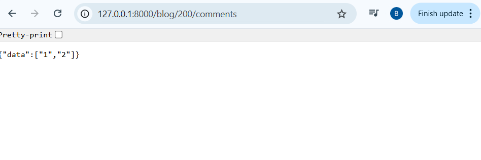


In order to do the same for the user, we face a problem: How do we refer to ShowBlog inside ShowUser schema when it is before the ShowBlog schema? We can’t move it again because that will undo what we did for the blog. 

Remember that adding the config function to a schema simply hides the id when it is displayed as a result. So we can make a new config for Blog instead of ShowBlog that just extends the Blog schema and adds a config to hide the id. We can now place this new schema before the ShowUser schema. Note: This new schema is Blog, and we’ve renamed the old ‘Blog’ to ‘BlogBase’.

Full [schemas.py](schemas.py): 


```
from pydantic import BaseModel
from typing import List

class BlogBase(BaseModel):
    title: str
    body: str

class Blog(BlogBase):
    class Config():
        orm_mode = True

class User(BaseModel):
    name: str
    email: str
    password: str

class ShowUser(BaseModel):
    name: str
    email: str
    blog : List[Blog]

    class Config():
        orm_mode = True

class ShowBlog(BaseModel):
    title: str
    body: str
    owner: ShowUser


    class Config():
        orm_mode = True
```


## API Router

Make a new folder inside the blogs folder. Make 3 files: __init__.py, user.py , blog.py 

1) Take the get_db function from [main.py](main.py) to [database.py](database.py). Remember to import get_db from database to [user.py](user.py) and [blog.py](blog.py) later.

2) Inside [blog.py](blog.py) , transfer all the routes from [main.py](main.py) but change ‘app’ to ‘router’. Also import all the required dependencies. 

3) Inside [user.py](user.py), transfer all the routes from [main.py](http://main.py) but change ‘app’ to ‘router’. Also import all the required dependencies. 

Simplify the [main.py](main.py) file by calling the [user.py](user.py) and [blog.py](blog.py) instead of writing all the functions there. 

Updated [main.py](main.py):


```
from fastapi import FastAPI, Depends, status, Response, HTTPException
from . import schemas
from . import models
from .hashing import Hash
from .database import engine, SessionLocal, get_db
from sqlalchemy.orm import Session
from typing import List
from blog.routers import blog, user

app = FastAPI()

models.Base.metadata.create_all(engine)

app.include_router(blog.router)
app.include_router(user.router)
```


NOTE: We don’t need all these import statements in [main.py](main.py) anymore. I just didn’t bother removing them.

[user.py](user.py) inside routers folder:


```
from fastapi import APIRouter, Depends, status, HTTPException
from .. import schemas
from .. import database, models
from sqlalchemy.orm import Session
from ..hashing import Hash

get_db = database.get_db

router = APIRouter()

@router.post('/user', response_model= schemas.ShowUser, tags=['user'])
def create_user(request: schemas.User, db: Session = Depends(get_db)):
    new_user = models.User(name = request.name, email = request.email, password = Hash.bcrypt(request.password))
    db.add(new_user)
    db.commit()
    db.refresh(new_user)
    return new_user

@router.get('/user/{id}', response_model = schemas.ShowUser, tags=['user'])
def get_user(id:int, db: Session = Depends(get_db)):
    user = db.query(models.User).filter(models.User.id == id).first()
    if not user:
        raise HTTPException(status_code = status.HTTP_404_NOT_FOUND, detail = f"User with id {id} not found")
    return user
```


[blog.py](blog.py) inside routers folder:


```
from fastapi import APIRouter, Depends, status, HTTPException
from .. import schemas
from typing import List
from .. import database, models
from sqlalchemy.orm import Session

get_db = database.get_db

router = APIRouter()

@router.get('/blog', response_model = List[schemas.ShowBlog], tags=['blogs'])
def all( db : Session = Depends(database.get_db)):

    #to get all the blogs
    blogs = db.query(models.Blog).all()
    return blogs
```


This doesn’t include all the blog related functions cut-pasted to [blog.py](blog.py) from [main.py](main.py). Only the first function was pasted for demonstration.


<p id="gdcalert18" ><span style="color: red; font-weight: bold">>>>>>  gd2md-html alert: inline image link here (to images/image18.png). Store image on your image server and adjust path/filename/extension if necessary. </span><br>(<a href="#">Back to top</a>)(<a href="#gdcalert19">Next alert</a>)<br><span style="color: red; font-weight: bold">>>>>> </span></p>


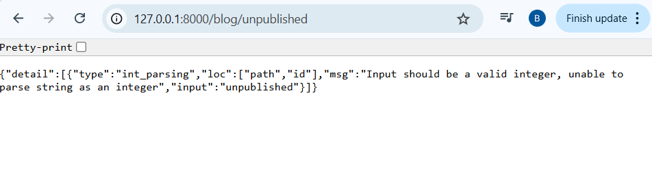


## API Router Operations

**1) TAGS:** Now we don’t need to specify the tags for every function. Since all the user and blog functions are in separate router files, we can just specify the tag when initializing the API routers. 

Initialization: 


```
router = APIRouter(
    tags = ['blogs']
)
```


Now remove the tags from each function. Do the same for users

**2) PREFIXING: **We can remove ‘/blog’ from every path once we prefix it in the initialization.


```
router = APIRouter(
    tags = ['Blogs'],
    prefix = "/blog"
)
```


Updated function example:


```
@router.delete('/{id}', status_code = status.HTTP_204_NO_CONTENT)
```


Do the same for users.

3) IDK

Create new files to hold repetitive commands to make functions smaller. Example: Create a new folder ‘repository’ with a file ‘[blog.py](blog.py)’

-Now we can demonstrate this operation on the get_all function

**[repository.blog.py](repository.blog.py): **


```
from sqlalchemy.orm import Session
from .. import models

def get_all(db: Session):
    blogs = db.query(models.Blog).all()
    return blogs
```


**Updated [routers.blog.py](routers.blog.py):**


```
From ..repository import blog

@router.get('/', response_model = List[schemas.ShowBlog])
def all( db : Session = Depends(database.get_db)):
    return blog.get_all(db)
```


-Demonstrating using create function:

**Addition to [repository.blog.py](repository.blog.py) **


```
def create(request: schemas.Blog, db: Session):
    new_blog = models.Blog(title=request.title, body=request.body, user_id = 1)
    db.add(new_blog)
    db.commit()
    db.refresh(new_blog)
    return new_blog
```


**Updated [routers.blog.py](routers.blog.py)**


```
@router.post('/', status_code=status.HTTP_201_CREATED)
def create(request: schemas.Blog, db : Session = Depends(database.get_db)):
    return blog.create(request, db)
```


Same for all functions related to blogs. Also for users.

NOTE: In the files, I have not done the same operations for users. The functions are left as they were earlier (long form)


## Login and Verify Password

Create a file ‘[authentication.py](authentication.py)’ inside the routers folder. Add it to the [main.py](main.py) file (the way we did for users and blogs)


```
app.include_router(authentication.router)
```


[authentication.py](authentication.py) (initial)


```
from fastapi import APIRouter

router = APIRouter(
    tags=['Authentication']
)

@router.post('/login')

def login():
    return 'login'
```


Add Login schema in [schemas.py](schemas.py)


```
class Login(BaseModel):
    username: str
    password: str
```


Add a verify function inside [hashing.py](hashing.py)


```
from passlib.context import CryptContext

pwd_cxt = CryptContext(schemes=["bcrypt"], deprecated="auto")
class Hash():
    def bcrypt(password: str):
        return pwd_cxt.hash(password)


    def verify(plain_password, hashed_password):
        return pwd_cxt.verify(plain_password, hashed_password)
```


Verify the password in [authenticate.py](authenticate.py)


```
def login(request: schemas.Login, db: Session = Depends(database.get_db)):
    user = db.query(models.User).filter(models.User.email == request.username).first()
    if not user:
        raise HTTPException(status_code = status.HTTP_404_NOT_FOUND, detail = 'Invalid Credentials')


    if Hash.verify(user.password, request.password):
        raise HTTPException(status_code = status.HTTP_404_NOT_FOUND, detail = 'Incorrect Password')

    #generate a jwt token and return it
    return user
```


## JWT Access Token

- pip install python-jose

STEP 1: Create 2 new schemas in [schema.py](schema.py)


```
class Token(BaseModel):
    access_token: str
    token_type: str

class TokenData(BaseModel):
    username: str | None = None
```


STEP 2: Create [token.py](token.py)


```
from datetime import datetime, timedelta, timezone
from jose import JWTError, jwt

SECRET_KEY = "09d25e094faa6ca2556c818166b7a9563b93f7099f6f0f4caa6cf63b88e8d3e7"
ALGORITHM = "HS256"
ACCESS_TOKEN_EXPIRE_MINUTES = 30

def create_access_token(data: dict):
    to_encode = data.copy()
    expire = datetime.now(timezone.utc) + timedelta(minutes=ACCESS_TOKEN_EXPIRE_MINUTES)
    to_encode.update({"exp": expire})
    encoded_jwt = jwt.encode(to_encode, SECRET_KEY, algorithm=ALGORITHM)
    return encoded_jwt
```


STEP 3: Edit login function in [authenticate.py](authenticate.py)


```
def login(request: schemas.Login, db: Session = Depends(database.get_db)):
    user = db.query(models.User).filter(models.User.email == request.username).first()
    if not user:
        raise HTTPException(status_code = status.HTTP_404_NOT_FOUND, detail = 'Invalid Credentials')


    if Hash.verify(user.password, request.password):
        raise HTTPException(status_code = status.HTTP_404_NOT_FOUND, detail = 'Incorrect Password')

    #generate a jwt token and return it
    access_token = token.create_access_token(data={"sub": user.email})
    return schemas.Token(access_token=access_token, token_type="bearer")
```


All these codes are copy-pasted and edited directly from the documentation: 

[https://fastapi.tiangolo.com/tutorial/security/oauth2-jwt/?h=jwt#hash-and-verify-the-passwords](https://fastapi.tiangolo.com/tutorial/security/oauth2-jwt/?h=jwt#hash-and-verify-the-passwords)

No need to remember these codes

Now finally, we need to hide some of the routes behind this authentication token. 


## Route Behind Authentication

Lots of snippets of code must be changed across various files. Most of the new code to be written is to be taken from the official documentation.

This is an example of the ‘get’ function being hidden behind authentication:


    

<p id="gdcalert19" ><span style="color: red; font-weight: bold">>>>>>  gd2md-html alert: inline image link here (to images/image19.png). Store image on your image server and adjust path/filename/extension if necessary. </span><br>(<a href="#">Back to top</a>)(<a href="#gdcalert20">Next alert</a>)<br><span style="color: red; font-weight: bold">>>>>> </span></p>


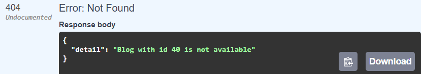


Pop-up menu for authorization:


     

<p id="gdcalert20" ><span style="color: red; font-weight: bold">>>>>>  gd2md-html alert: inline image link here (to images/image20.png). Store image on your image server and adjust path/filename/extension if necessary. </span><br>(<a href="#">Back to top</a>)(<a href="#gdcalert21">Next alert</a>)<br><span style="color: red; font-weight: bold">>>>>> </span></p>


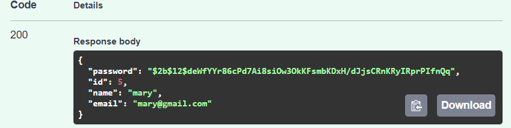


General Workflow: 

Create an [oauth2.py](oauth2.py) file


```
from fastapi import Depends, HTTPException, status
from . import token
from fastapi.security import OAuth2PasswordBearer
from typing import Annotated

oauth2_scheme = OAuth2PasswordBearer(tokenUrl = "login")

def get_current_user(data: Annotated[str, Depends(oauth2_scheme)]):
    credentials_exception = HTTPException(
        status_code=status.HTTP_401_UNAUTHORIZED,
        detail="Could not validate credentials",
        headers={"WWW-Authenticate": "Bearer"},
    )

    return token.verify_token(data, credentials_exception)
```


Make changes in the login function inside [authentication.py](authentication.py)


```
def login(request: OAuth2PasswordRequestForm = Depends(), db: Session = Depends(database.get_db)):
    user = db.query(models.User).filter(models.User.email == request.username).first()
    if not user:
        raise HTTPException(status_code = status.HTTP_404_NOT_FOUND, detail = 'Invalid Credentials')


    if not Hash.verify(user.password, request.password):
        raise HTTPException(status_code = status.HTTP_404_NOT_FOUND, detail = 'Incorrect Password')

    #generate a jwt token and return it
    access_token = token.create_access_token(data={"sub": user.email})
    return schemas.Token(access_token=access_token, token_type="bearer")
```


Add this snippet to the functions inside [blog.py](blog.py) that need to be protected by authentication.


```
current_user: schemas.User = Depends(oauth2.get_current_user)
```


Many other snippets need to be changed according to the requirements of the application.
